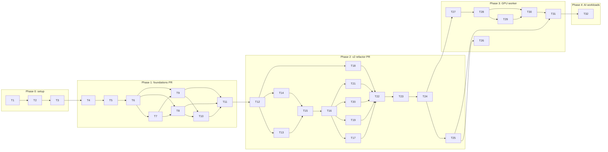

# Task plan: TKS v2 and the GPU worker

- Status: Draft for review
- Date: 2026-10-09
- Source: the PRD, which becomes the body of the epic issue in T3
- This file is a review copy. It is not committed to `main`. At T3 every task becomes an issue, and from then on the issues are the plan.

Every task below becomes a GitHub issue titled `[T<id>] <title>`, in the repository named on the task, and all of them go on one GitHub Project. `Depends on` becomes GitHub's "blocked by" relationship. Task 1 is the only task with no dependency, and tasks 26 and 32 are the only ones nothing depends on. Every task is connected to the graph.

Rules for every task:
- Nothing merges to `main` without TJ's approval. Renovate's auto-merges are the one standing exception TJ chose ([0012](decisions/0012-renovate-automerge.md)).
- Nothing runs against real infrastructure without TJ's approval for that run: `terraform apply` or `destroy`, `talosctl`, `kubectl`, SSH, or Proxmox API calls.
- Behavior changes ship with `terraform test` coverage, and doc changes ship in the PR that causes them.

## Dependency graph

---

## Phase 0: Setup

### T1. Tag `v1.0.0` on the current `main`
- Repo: TKS
- Depends on: none
- Context: TKS has no tags, and v2 is breaking ([0003](decisions/0003-v2-breaking-rebuild.md), [0019](decisions/0019-a-handful-of-prs.md)). Existing users need a pin before anything v2 merges.
- Subtasks:
  - [ ] 1.1 Confirm `origin/main` HEAD with TJ, and get approval to push the tag.
  - [ ] 1.2 `git tag -a v1.0.0 -m "TKS v1: last release before the v2 rewrite"` on that commit, then push the tag.
  - [ ] 1.3 Create a GitHub Release `v1.0.0` whose notes say v2 is a breaking rebuild and that `git checkout v1.0.0` keeps v1.
- Done when: the tag and release exist on GitHub.

### T2. Review and merge the planning PR
- Repo: TKS
- Depends on: T1
- Context: this PR (`docs/v2-plan`) merges `docs/decisions/` and `CLAUDE.md`. The PRD and this plan are reviewed through links to an earlier commit on the branch, and are never committed to `main`. Merging the PR is TJ's sign-off on all four.
- Subtasks:
  - [ ] 2.1 TJ reviews in the PR, and comments are resolved by follow-up commits.
  - [ ] 2.2 TJ approves and merges, with the title `docs: plan TKS v2 and the GPU worker`.
- Done when: the PR is merged to `main`.

### T3. Create labels, the GitHub Project and one issue per task
- Repos: TKS, Bootstrap-Proxmox, Kubernetes-Manifests
- Depends on: T2
- Context: tracking is issues in each repo plus one cross-repo Project. The current `gh` token lacks the `project` scope, so TJ runs `gh auth refresh -s project` first.
- Subtasks:
  - [ ] 3.1 Get the `project` scope on the token.
  - [ ] 3.2 Create the labels `phase:0-setup` … `phase:4-ai` and `needs-tj` (an apply or approval step) in each repo that gets issues.
  - [ ] 3.3 Create a user-level Project "TKS v2 + GPU" with the default Status field.
  - [ ] 3.4 Create the epic issue `[Epic] TKS v2 and the GPU worker` in TKS. Its body is the PRD, with relative links rewritten to absolute GitHub URLs, and it is pinned.
  - [ ] 3.5 Create one issue per task (T1–T32). The body is the task text, and the subtasks are a checklist. T26 goes in Bootstrap-Proxmox, T32 in Kubernetes-Manifests, the rest in TKS. Each is a sub-issue of the epic.
  - [ ] 3.6 Add a "blocked by" relationship for each `Depends on`, and add every issue, epic included, to the Project.
  - [ ] 3.7 Close T1–T3 with links.
- Done when: the Project shows the epic and its 32 sub-issues, and every dependency appears as a relationship.

## Phase 1: Repository foundations (one PR)

Branch `ci/foundations`, titled `ci: add checks, releases, Renovate and docs skeleton`.

### T4. Repository hygiene
- Repo: TKS
- Depends on: T3
- Context: the current `.gitignore` pattern `.terraform*` also ignores `.terraform.lock.hcl`, which should be committed so provider hashes get reviewed.
- Subtasks:
  - [ ] 4.1 Rewrite `.gitignore` from GitHub's Terraform template plus TKS entries: `config.env`, `talosconfig`, `kubeconfig`, `*_override.tf` and `.DS_Store`. Keep `.terraform.lock.hcl` tracked.
  - [ ] 4.2 Add `.editorconfig` (2-space HCL and YAML, LF line endings, final newline).
  - [ ] 4.3 Confirm `CODEOWNERS` and `LICENSE` (GPL-3.0) stay as they are.
- Done when: `git status` is clean after `terraform init`.

### T5. Pinned toolchain and Make targets
- Repo: TKS
- Depends on: T4
- Context: CI and local runs must execute the same tools at the same versions ([0013](decisions/0013-ci-and-semver-releases.md)). Run tools from pinned container images, so the only local requirements are Docker and Make.
- Subtasks:
  - [ ] 5.1 Add a `Makefile` with targets `fmt`, `fmt-check`, `validate`, `lint`, `scan`, `test`, `actionlint`, `docs` and `check` (all of them). Each uses a pinned image: `hashicorp/terraform`, `ghcr.io/terraform-linters/tflint`, `aquasec/trivy`, `rhysd/actionlint` and `quay.io/terraform-docs/terraform-docs`.
  - [ ] 5.2 Make `validate` iterate over every root and module with `init -backend=false`, discovering them by directory so `bootstrap/` and new modules are picked up automatically.
  - [ ] 5.3 Add `.tflint.hcl` with `plugin "terraform" { preset = "recommended" }`.
  - [ ] 5.4 Add `trivy.yaml`: severity HIGH and CRITICAL, exit code 1, Terraform misconfiguration scanning only.
  - [ ] 5.5 Keep the image versions as Make variables, one per line, so Renovate can bump them (T8).
- Done when: `make check` runs, passing on v1 or with each v1 failure listed for T12.

### T6. Pull-request CI workflow
- Repo: TKS
- Depends on: T5
- Subtasks:
  - [ ] 6.1 `.github/workflows/pr.yml` on `pull_request` and on `push` to `main`, with `permissions: contents: read` and a concurrency group per ref.
  - [ ] 6.2 Separate jobs `fmt`, `validate`, `lint`, `scan`, `test` and `actionlint`, each calling its Make target.
  - [ ] 6.3 The `scan` job uploads Trivy SARIF to code scanning, with `security-events: write` on that job only.
  - [ ] 6.4 SHA-pin every action, with a version comment.
  - [ ] 6.5 Cache provider plugins between runs (`TF_PLUGIN_CACHE_DIR`).
- Done when: the foundations PR shows all six checks green.

### T7. Conventional PR titles and automated semver releases
- Repo: TKS
- Depends on: T6
- Context: as in Bluebird, the squash commit title is the PR title, and that title decides the version bump ([0013](decisions/0013-ci-and-semver-releases.md)).
- Subtasks:
  - [ ] 7.1 `.github/workflows/pr-title.yml` fails unless the title matches `^(feat|fix|perf|refactor|chore|docs|style|test|ci|build)(\([^)\r\n]+\))?!?: .+`.
  - [ ] 7.2 `.github/workflows/release.yml` on `push` to `main` reads the merged commit's title and computes the next version from the latest `v*` tag: `!` is major, `feat` is minor, anything else is patch.
  - [ ] 7.3 The release job creates the annotated tag and a GitHub Release with generated notes, with `contents: write` on that job only.
  - [ ] 7.4 The PR-title workflow prints the version a merge would cut, so reviewers see it before merging.
- Done when: the foundations PR shows the predicted version.

### T8. Renovate base configuration
- Repo: TKS
- Depends on: T6, T7
- Context: [0012](decisions/0012-renovate-automerge.md). The Talos and Kubernetes managers are deliberately **not** added here. They land in T21 with v2, so no version bump can auto-merge into v1 `main`, where a version change replaces VMs.
- Subtasks:
  - [ ] 8.1 Extend `config:recommended`, `helpers:pinGitHubActionDigests` and `:semanticCommits`, and enable the dependency dashboard.
  - [ ] 8.2 Package rules: auto-merge `patch`, `minor` and `digest` (`automerge: true`, `platformAutomerge: true`), and leave `major` alone.
  - [ ] 8.3 A regex manager for the Makefile's tool images (datasource `docker`). Renovate's built-in Terraform manager already covers providers and `required_version`.
  - [ ] 8.4 Validate with `npx --yes renovate-config-validator`.
- Done when: the validator passes and the dependency dashboard lists the providers, Actions and tool images.

### T9. GitHub repository settings
- Repo: TKS (settings, not code)
- Depends on: T6, T7
- Context: auto-merge is only safe if required checks gate `main`. These are outward-facing settings changes, so each one is shown to TJ before it's applied.
- Subtasks:
  - [ ] 9.1 A ruleset on `main` that requires a PR, the six T6 checks and the title check, and blocks force pushes and deletion.
  - [ ] 9.2 Keep required approvals at 0. GitHub doesn't let an author approve their own PR, and agent PRs are opened with TJ's token, so "TJ approves" means TJ presses merge. Renovate also needs 0 to auto-merge.
  - [ ] 9.3 Squash merges only, with the PR title as the default commit message. Allow auto-merge, and delete head branches after merge.
  - [ ] 9.4 Turn on secret scanning, push protection and Dependabot security alerts (no Dependabot version PRs).
- Done when: `gh api repos/zimmertr/TJs-Kubernetes-Service/rulesets` and the repository settings match this list.

### T10. Docs skeleton, README index and contribution files
- Repo: TKS
- Depends on: T8, T9
- Context: [0018](decisions/0018-docs-for-users.md). v2's behavior is documented by T22. This task creates the structure and writes the pages about the foundations, which need the CI, Renovate and repository settings to exist first.
- Subtasks:
  - [ ] 10.1 Turn the README into an index: summary, requirements table, quick start, and a docs table.
  - [ ] 10.2 Create `docs/ARCHITECTURE.md`, `docs/USAGE.md`, `docs/CONFIGURATION.md` and `docs/SECURITY_GUIDE.md` with their section headings.
  - [ ] 10.3 Write `docs/CICD.md` in full: each check, the release flow, the Renovate rules, and the required checks.
  - [ ] 10.4 Add `CONTRIBUTING.md` (issue first, conventional titles, `make check`) and a root `SECURITY.md` (how to report a vulnerability).
  - [ ] 10.5 Update `CLAUDE.md`'s development commands.
- Done when: every README link resolves and no page restates another.

### T11. Merge the foundations PR and verify the first release
- Repo: TKS
- Depends on: T8, T10, T9
- Subtasks:
  - [ ] 11.1 TJ reviews and merges `ci/foundations`.
  - [ ] 11.2 Confirm `release.yml` cut `v1.0.1` (a `ci:` title is a patch) and published a release.
  - [ ] 11.3 Confirm Renovate opened or updated its dashboard issue.
- Done when: the release exists and `main` is protected.

## Phase 2: The v2 refactor (one PR)

Branch `refactor/v2`, titled `feat!: TKS v2 with modules, node maps, static IPs and in-place upgrades`. Each task is one or more commits in this PR, and its tests are part of the task.

### T12. Upgrade the toolchain and adopt the providers' current resources
- Repo: TKS
- Depends on: T11
- Subtasks:
  - [ ] 12.1 `required_version = ">= 1.16"`, `bpg/proxmox ~> 0.116.0` and `siderolabs/talos ~> 0.12.0`. Keep the patch-level pin, because bpg's 0.x minors can break. Regenerate the lock file for `linux_amd64`, `darwin_arm64` and `darwin_amd64`.
  - [ ] 12.2 Use the `proxmox_*` short names where they exist (`proxmox_download_file`, `proxmox_hardware_mapping_pci`, `proxmox_acl`, `proxmox_user_token`). Keep `proxmox_virtual_environment_vm`, `_pool`, `_user` and `_role`, which have none. Never the experimental `proxmox_vm`.
  - [ ] 12.3 Remove `hashicorp/http`, since T14 uses the Talos provider's Image Factory support instead.
- Done when: `make validate` passes.

### T13. Typed variables and validation
- Repo: TKS
- Depends on: T12
- Context: [0009](decisions/0009-nodes-as-maps.md) and [0011](decisions/0011-in-place-upgrades-by-terraform.md). This replaces about 40 flat variables.
- Subtasks:
  - [ ] 13.1 `proxmox` object: `node_name`, `datastore_id` (default `FlashPool`), `image_datastore_id` (default `local`), `resource_pool`.
  - [ ] 13.2 `network` object: `cidr`, `gateway`, `vlan_id` (optional), `bridge` (default `vmbr0`), `dns_servers` (list).
  - [ ] 13.3 `cluster` object: `name`, `vip`, `talos_version` (the installed OS, default `v1.14.2`), `talos_config_version` (the config contract, required, pinned at creation), `kubernetes_version` (default `v1.37.1`), `disable_flannel` (false), `expose_metrics` (false).
  - [ ] 13.4 Pool objects `controlplane`, `workers` and `gpu_workers`, each `{ defaults = { cores, memory_mb, disk_gb, tags }, nodes = map(object({ ip, vm_id, cores?, memory_mb?, disk_gb?, tags? })) }`. `gpu_workers.nodes` defaults to `{}`.
  - [ ] 13.5 Validations: every IP inside `network.cidr`; IPs unique across pools; VMIDs unique; the VIP inside the CIDR and not a node IP; at least one control plane.
  - [ ] 13.6 `tests/variables.tftest.hcl`: one `expect_failures` run per validation, plus one valid run.
- Done when: `make test` covers each validation.

### T14. `modules/talos_image`
- Repo: TKS
- Depends on: T12
- Context: [0010](decisions/0010-qcow2-images-no-ssh.md). Replaces `talos_image.tf`, its `http` POST and its `remote-exec`.
- Subtasks:
  - [ ] 14.1 Inputs: `cluster_name`, `talos_version`, `extensions` (default `["siderolabs/qemu-guest-agent"]`), `node_name`, `datastore_id`, `pool_name`.
  - [ ] 14.2 `talos_image_factory_schematic` built from `extensions`, then `data.talos_image_factory_urls` with `platform = "nocloud"` and `disk_image_format = "qcow2"`.
  - [ ] 14.3 `proxmox_download_file`: `content_type = "import"`, the qcow2 URL, no decompression, and the file name `tks-<cluster>-<pool>-<talos_version>.qcow2`, so clusters and pools never collide.
  - [ ] 14.4 Outputs: `file_id`, `schematic_id` and `installer_image` (from `urls.installer`).
  - [ ] 14.5 Tests (mocked): the file name includes the cluster and pool; the `qcow2` format and `import` content type are set; the installer output passes through.
- Done when: tests pass, and the module has no provisioners.

### T15. `modules/node`: one pool of Talos VMs
- Repo: TKS
- Depends on: T13, T14
- Context: [0008](decisions/0008-static-ips-via-cloud-init.md), [0011](decisions/0011-in-place-upgrades-by-terraform.md), [0016](decisions/0016-q35-uefi-everywhere.md). Used here for control planes and workers, and by `gpu_worker` in T27.
- Subtasks:
  - [ ] 15.1 Inputs: `nodes` (the merged per-node map), `machine_type` (`controlplane` or `worker`), `image` (from T14), `network`, `proxmox`, `cluster`, `machine_secrets`, `client_configuration`, `kubeconfig` (for drains), `config_patches` (a list of strings), and `pci_devices` (a list of `{ mapping, pcie }`, default `[]`).
  - [ ] 15.2 `proxmox_virtual_environment_vm` with `for_each = nodes`:
    - `machine = "q35"`, `bios = "ovmf"`, and `efi_disk { type = "4m", pre_enrolled_keys = false }`
    - the `host` CPU type, fixed `memory.dedicated` with no ballooning
    - a `scsi0` disk with `import_from = image.file_id`
    - `agent { enabled = true, timeout = "1s" }`, keeping v1's comment about why
  - [ ] 15.3 `initialization { ip_config { ipv4 { address = "<ip>/<prefix>", gateway } } dns { servers } }`, with the cloud-init drive on the node datastore.
  - [ ] 15.4 A dynamic `hostpci` block from `pci_devices`, with `device = "hostpci<index>"`, `mapping` and `pcie`.
  - [ ] 15.5 `data.talos_machine_configuration` for each node, with `talos_version = cluster.talos_config_version` and patches: the pool's `config_patches` plus a per-node `HostnameConfig` document named after the map key, and the pool's install image.
  - [ ] 15.6 `talos_machine` for each node: `node = ip`, `image = installer_image`, `drain_on_upgrade = true`, `kubeconfig`, `ignore_kubernetes_upgrade_drift = true`, `on_destroy = { reset = true, graceful = true }`.
  - [ ] 15.7 Outputs: a map of node name to `{ ip, vm_id }`.
  - [ ] 15.8 Tests (mocked): one VM per map entry; the static IP and hostname are rendered; `pci_devices = []` gives no `hostpci`; changing `talos_version` changes `talos_machine.image` and keeps the VM's planned `id` known (not replaced).
- Done when: tests pass.

### T16. Root module wiring
- Repo: TKS
- Depends on: T15
- Subtasks:
  - [ ] 16.1 `talos_machine_secrets` with `talos_version = cluster.talos_config_version` and `lifecycle { prevent_destroy = true }`.
  - [ ] 16.2 `talos_machine_bootstrap` against the first control plane by sorted key, with `ignore_changes = [node, endpoint]` so removing that node later doesn't re-bootstrap.
  - [ ] 16.3 `talos_cluster` with `kubernetes_version`, which owns Kubernetes upgrades. Then `talos_cluster_kubeconfig` and `talos_client_configuration`.
  - [ ] 16.4 `proxmox_virtual_environment_pool`, one `talos_image` for the general pools, and `node` modules for control planes and workers. Merge defaults and overrides in `locals`.
  - [ ] 16.5 Outputs: `kubeconfig` and `talosconfig` (sensitive), plus `nodes` (name to IP and role).
  - [ ] 16.6 Delete the v1 `talos_*.tf` files, every flat variable, and `bin/`.
  - [ ] 16.7 Root tests (mocked): a two-pool cluster plans the expected counts; empty `gpu_workers` plans zero GPU resources; a lower `talos_config_version` is rejected by validation (guards the PKI-replacement trap).
- Done when: tests pass and `make check` is green.

### T17. Talos configuration patches
- Repo: TKS
- Depends on: T16
- Context: v1's patches use fields Talos 1.14 deprecates, and v1 enables DHCP on `eth0`, which would add a second address beside the static one.
- Subtasks:
  - [ ] 17.1 Move `configs/*.yml` to templates. Keep KubePrism and kubelet serving-certificate rotation.
  - [ ] 17.2 Express the control-plane VIP as a `Layer2VIPConfig` document, and drop `dhcp: true`.
  - [ ] 17.3 Enable the `ExtendedResourceToleration` admission plugin on every cluster ([0017](decisions/0017-gpu-taint-extended-resource-toleration.md)).
  - [ ] 17.4 Keep `disable_flannel` and `expose_metrics` as switches.
  - [ ] 17.5 A Make target and CI step that renders each config and runs `talosctl validate --mode cloud` (nocloud runs in cloud mode), for both switch combinations.
- Done when: validation passes in CI.

### T18. `bootstrap/` root for the Terraform user
- Repo: TKS
- Depends on: T12
- Context: [0005](decisions/0005-bootstrap-root-for-terraform-user.md). Optional, and applied once per Proxmox cluster with root credentials.
- Subtasks:
  - [ ] 18.1 `bootstrap/` with its own provider block and inputs `user_id` (default `tks@pve`), `role_id` (default `TKS`) and `token_name` (default `terraform`).
  - [ ] 18.2 `proxmox_virtual_environment_role` with the privileges derived from the Proxmox API permission docs, for every call TKS makes: VM create, config, power and console; disk import; `Datastore.AllocateSpace`, `Datastore.AllocateTemplate` and `Datastore.Audit`; `Pool.Allocate`; `Sys.Audit` and `Sys.Modify` (downloads, PCI listing); `Mapping.Audit`, `Mapping.Modify` and `Mapping.Use`; and `SDN.Use` for the bridge.
  - [ ] 18.3 `proxmox_virtual_environment_user`, `proxmox_acl` at `/`, and `proxmox_user_token` with `privileges_separation = false`. Output the token as a sensitive value.
  - [ ] 18.4 Tests (mocked): outputs exist, and the token is sensitive.
  - [ ] 18.5 `docs/SECURITY_GUIDE.md` lists each privilege and why TKS needs it.
- Done when: tests pass and the list is documented.

### T19. Apply ergonomics for rolling upgrades
- Repo: TKS
- Depends on: T16
- Context: `talos_machine` resources in one `for_each` upgrade in parallel unless Terraform is serialized ([0011](decisions/0011-in-place-upgrades-by-terraform.md)).
- Subtasks:
  - [ ] 19.1 Add `export TF_CLI_ARGS_apply="-parallelism=1"` to `vars/config.env.example`, with a comment explaining why.
  - [ ] 19.2 Order the control planes after the workers with `depends_on` between the two `node` modules, so workers roll first and control planes last.
  - [ ] 19.3 Document in `USAGE.md` that skipping `config.env` makes upgrades parallel.
- Done when: the example env file and docs say so.

### T20. Optional HCP Terraform state
- Repo: TKS (code and docs), plus HCP (TJ's account)
- Depends on: T16
- Context: [0007](decisions/0007-local-state-default-hcp-opt-in.md).
- Subtasks:
  - [ ] 20.1 `cloud_override.tf.example` in the root (tag `tks-cluster`) and in `bootstrap/` (name `tks-bootstrap`), and docs on copying them.
  - [ ] 20.2 TJ creates the HCP organization, plus the workspaces `tks-stable` and `tks-test` (tagged `tks-cluster`) and `tks-bootstrap`, all in local execution mode.
- Done when: `terraform workspace list` from TJ's laptop shows the HCP workspaces.

### T21. Renovate version managers and the compatibility check
- Repo: TKS
- Depends on: T16
- Context: [0012](decisions/0012-renovate-automerge.md). This lands with v2 so version bumps only ever reach v2 code.
- Subtasks:
  - [ ] 21.1 Regex managers for `talos_version` (datasource `github-releases`, `siderolabs/talos`) and `kubernetes_version` (`github-releases`, `kubernetes/kubernetes`), covering the variable defaults and `vars/*.tfvars`. `talos_config_version` is deliberately not managed.
  - [ ] 21.2 Package rules: Kubernetes minors don't auto-merge; everything else follows T8.
  - [ ] 21.3 Verify that `talosctl gen config --talos-version <talos> --kubernetes-version <k8s>` rejects unsupported pairs. If it doesn't, use Sidero's published support matrix instead, and if that grows into a large script, stop and check with TJ.
  - [ ] 21.4 `.github/workflows/compat.yml` on PRs that change either version: install `talosctl` at the proposed Talos version, run the check, post or update one sticky comment with the result, and fail on incompatibility. Make it a required check (T9's ruleset).
- Done when: a test PR bumping Kubernetes past the supported range gets a "not compatible" comment and a red check.

### T22. v2 documentation and example tfvars
- Repo: TKS
- Depends on: T17, T18, T19, T20, T21
- Subtasks:
  - [ ] 22.1 `vars/stable.tfvars` and `vars/test.tfvars` in the new shape, with the sizes and addresses from the epic's tech-stack section as the maintainer's examples.
  - [ ] 22.2 `docs/CONFIGURATION.md`: the `terraform-docs` reference (`make docs`), plus prose on pool defaults and overrides and on the two Talos versions.
  - [ ] 22.3 `docs/USAGE.md`: build, scale, upgrade (merge, then `apply`), remove a node, host reboots, and the optional `bootstrap/` and HCP setups.
  - [ ] 22.4 `docs/ARCHITECTURE.md`: modules, data flow and per-pool images.
  - [ ] 22.5 README Requirements: Proxmox 9.x; a token with the `SECURITY_GUIDE.md` privileges; the `Import` content type on the image datastore; and a DHCP range that excludes node IPs. No SSH is required.
  - [ ] 22.6 Release-note text for `v2.0.0`: breaking, rebuild, and pin `v1.0.0` to stay.
- Done when: every input is documented and the README links resolve.

### T23. Validate v2 on `test`
- Repo: TKS (TJ approves every apply and destroy)
- Depends on: T22
- Context: the first real apply of v2. Static addressing is checked first, because DHCP reservations are the fallback if it fails ([0008](decisions/0008-static-ips-via-cloud-init.md)).
- Subtasks:
  - [ ] 23.1 Destroy the v1 `test` cluster from a `v1.0.0` checkout, using the existing token.
  - [ ] 23.2 Enable `Import` on the image datastore if it isn't already (a manual host step for TJ).
  - [ ] 23.3 Apply `bootstrap/` with root credentials (HCP `tks-bootstrap`), and put the new token in `config.env`.
  - [ ] 23.4 Apply v2 `test` (HCP `tks-test`) with one control plane and one worker. Confirm each node has its static IP and its hostname, the guest agent reports, and the nodes are Ready.
  - [ ] 23.5 Add a second worker, then remove the *first*. Confirm only that node is touched, and that `on_destroy` reset it and it left Kubernetes.
  - [ ] 23.6 Raise `talos_version` by one patch. Confirm the plan replaces no VM and doesn't touch `talos_machine_secrets`. After `apply`, confirm the new version on every node and that `qemu-guest-agent` is still loaded.
  - [ ] 23.7 Raise `kubernetes_version` by one patch. Confirm `talos_cluster` performs the upgrade and `talos_machine` reports no drift.
  - [ ] 23.8 Shut the worker down from Proxmox (guest-agent shutdown), start it again, and confirm it returns Ready and schedulable without manual uncordoning. If not, open an issue for a small helper.
  - [ ] 23.9 Fix whatever the token lacked during 23.4–23.7 in `bootstrap/` and `SECURITY_GUIDE.md`.
- Done when: every check passes. Failures become linked issues.

### T24. Merge the refactor PR and release `v2.0.0`
- Repo: TKS
- Depends on: T23
- Subtasks:
  - [ ] 24.1 TJ approves and merges `refactor/v2`.
  - [ ] 24.2 Confirm `v2.0.0` was cut, and add the T22.6 notes to the release.
- Done when: the release exists.

### T25. Rebuild `stable` on v2
- Repo: TKS (TJ approves every step)
- Depends on: T24
- Context: TJ rebinds the static PVs and re-bootstraps Argo CD from Kubernetes-Manifests himself. That work isn't tracked here.
- Subtasks:
  - [ ] 25.1 With TJ: drain `stable` with `kubectl` if he wants a graceful stop, then `terraform destroy` from a `v1.0.0` checkout with the old token.
  - [ ] 25.2 Apply v2 `stable` (HCP `tks-stable`) with the epic's sizes: control planes at VMIDs 4011–4013, workers at 4021–4023.
  - [ ] 25.3 Confirm all nodes are Ready, then hand over to TJ for the workload restore.
- Done when: TJ confirms the workloads are back.

## Phase 3: GPU worker

Branch `feat/gpu-worker`, titled `feat: add the optional GPU worker pool`, plus one Bootstrap-Proxmox PR.

### T26. Bootstrap-Proxmox cleanup
- Repo: Bootstrap-Proxmox
- Depends on: T25 (`stable` uses the old user until it's rebuilt)
- Context: [0004](decisions/0004-ready-hypervisor.md), [0005](decisions/0005-bootstrap-root-for-terraform-user.md).
- Subtasks:
  - [ ] 26.1 Delete the `enable_iommu` role and its playbook entry. The IOMMU is on by default for Intel CPUs on kernel 6.8+, and qemu-server loads `vfio-pci` on demand. The existing GRUB flags on `earth` are harmless.
  - [ ] 26.2 Remove the TKS Terraform user from `create_user`'s defaults, and keep the proxmox-csi-plugin user.
  - [ ] 26.3 Update the README's role table.
- Done when: TJ merges the Bootstrap-Proxmox PR.

### T27. `modules/gpu_worker`
- Repo: TKS
- Depends on: T24
- Context: [0002](decisions/0002-gpu-worker-module.md), [0006](decisions/0006-gpu-found-by-class.md), [0017](decisions/0017-gpu-taint-extended-resource-toleration.md).
- Subtasks:
  - [ ] 27.1 Inputs:
    - `nodes` (from `gpu_workers`)
    - `pci_vendor_id` (default `"0x1002"`) and `pci_class` (default `"0x03"`), matched by prefix
    - `pci_address` (optional, to choose between several matches)
    - `talos_extensions` (qemu-guest-agent plus `siderolabs/amdgpu`)
    - the cluster plumbing `node` needs
  - [ ] 27.2 `data "proxmox_hardware_pci"` with `pci_class_blacklist = []` and a `filters` block, plus a `precondition`: exactly one match, or `pci_address` selects one.
  - [ ] 27.3 `proxmox_hardware_mapping_pci` named `<cluster>-gpu`. Its `map` entry holds the node, the address as `path`, `id = "<vendor>:<device>"` and `subsystem_id = "<subsystem_vendor>:<subsystem_device>"` (with the `0x` prefixes stripped), and `iommu_group`.
  - [ ] 27.4 Its own `talos_image` (pool `gpu`), then a `node` call with `pci_devices = [{ mapping = <name>, pcie = true }]`.
  - [ ] 27.5 A worker patch giving the taint `amd.com/gpu:NoSchedule` and the label `tks.io/pool=gpu`, using Talos 1.14's node-config documents.
  - [ ] 27.6 Wire it into the root, and include GPU nodes in the `nodes` output.
  - [ ] 27.7 Tests (mocked): no nodes means zero resources; two matches without `pci_address` fail the precondition; the mapping is built from data-source values with the prefixes stripped; the VM has `hostpci` with `pcie = true`.
  - [ ] 27.8 Docs: a GPU section in `USAGE.md`, the inputs in `CONFIGURATION.md`, the README requirement "IOMMU-capable host; GPU alone in its IOMMU group", and an `ARCHITECTURE.md` update.
- Done when: tests pass and `make check` is green.

### T28. First attach and reset test on `test`
- Repo: TKS (TJ approves every apply and VM action)
- Depends on: T27
- Context: [0015](decisions/0015-gpu-reset-risk-accepted.md). This decides whether T29 has any work.
- Subtasks:
  - [ ] 28.1 Add `test-k8s-node-gpu-1` (.71 / 4071, 8 cores, 32 GB) to `test.tfvars`, plan, and confirm the plan shows the discovered GPU with no address written anywhere. Then apply.
  - [ ] 28.2 Confirm `amdgpu` loaded (`talosctl dmesg`), that `/dev/dri/renderD*` and `/dev/kfd` exist, and that the node has its taint and label.
  - [ ] 28.3 In a namespace labeled `pod-security.kubernetes.io/enforce=privileged` (Talos enforces "baseline" by default), run a one-off privileged pod with `/dev/kfd` and `/dev/dri` mounted, using `rocm/rocm-terminal`. Check that `rocminfo` lists gfx1201, that `vulkaninfo --summary` works, and record the PCIe atomics status.
  - [ ] 28.4 Reset cycles: three each of an in-guest reboot (`talosctl reboot`), a Proxmox stop then start, and a Proxmox reset. Repeat 28.2 after each.
  - [ ] 28.5 Record the results in [0015](decisions/0015-gpu-reset-risk-accepted.md) as an Evidence update, and in the T29 issue.
- Done when: the results are recorded, whichever way they went.

### T29. Reset mitigation, if needed
- Repo: Bootstrap-Proxmox (or manual)
- Depends on: T28
- Context: if T28's cycles all pass, close this as not needed and link the evidence. Otherwise do the following. A hypervisor reboot is never automated. TKS's API token can't set hookscripts (root-only) or upload snippets (needs SSH), so mitigations live on the host side.
- Subtasks:
  - [ ] 29.1 With TJ's approval, read `/sys/bus/pci/devices/<gpu>/reset_method` on the host.
  - [ ] 29.2 Try the host-driver approach: let the host's `amdgpu` bind the card at boot, or `softdep amdgpu pre: vfio-pci`, as a Bootstrap-Proxmox role. Re-run T28.4.
  - [ ] 29.3 If that still fails, try a post-stop hookscript that rebinds `amdgpu`, installed by hand or by Bootstrap-Proxmox and attached as root. Record how it coexists with Terraform's view of the VM. Re-run T28.4.
  - [ ] 29.4 If nothing works, document the limitation (a GPU-node reboot needs a host reboot) in `USAGE.md` and in [0015](decisions/0015-gpu-reset-risk-accepted.md).
- Done when: the cycles pass, or the limitation is documented.

### T30. Merge the GPU PR and release `v2.1.0`
- Repo: TKS
- Depends on: T28, T29
- Subtasks:
  - [ ] 30.1 TJ approves and merges `feat/gpu-worker`.
  - [ ] 30.2 Confirm `v2.1.0` was cut.
  - [ ] 30.3 With TJ: remove `test-k8s-node-gpu-1` from `test.tfvars` and apply, which frees the GPU.
- Done when: the release exists and the `test` GPU node is gone.

### T31. Move the GPU to `stable`
- Repo: TKS (TJ approves)
- Depends on: T30, T25
- Subtasks:
  - [ ] 31.1 Add `k8s-node-gpu-1` (.31 / 4031, 16 cores, 192 GB) to `stable.tfvars` and apply.
  - [ ] 31.2 Repeat T28.2 on `stable`, and run one Proxmox stop/start cycle.
  - [ ] 31.3 Confirm the host's committed memory matches the epic's 296 GB budget.
- Done when: `stable` has a Ready GPU node with its taint and label.

## Phase 4: AI workloads

### T32. Plan the AI workloads in Kubernetes-Manifests
- Repo: Kubernetes-Manifests
- Depends on: T31
- Context: out of scope for the TKS epic. This is the placeholder epic for its own planning pass. The intended direction from the TKS interview: llama-swap in front of llama.cpp (Vulkan first, ROCm benchmarked), one inference server owning the GPU, and an OpenAI-compatible endpoint for LAN and cluster clients.
- Subtasks:
  - [ ] 32.1 Hold a planning interview and write a PRD in Kubernetes-Manifests.
  - [ ] 32.2 Choose between the AMD GPU Operator (inbox driver, `driver.enable=false`) and the standalone ROCm device plugin on Talos. Either DaemonSet needs an explicit toleration for the GPU taint.
  - [ ] 32.3 Model storage: a 500 GB PVC on `proxmox-flashpool`, which is thin-provisioned since 2026-10-09.
  - [ ] 32.4 Exposure, authentication, and whether a gateway such as LiteLLM goes in front.
  - [ ] 32.5 Where image generation fits: in llama-swap's rotation, or as a second GPU consumer.
- Done when: the Kubernetes-Manifests plan exists with its own issues.
